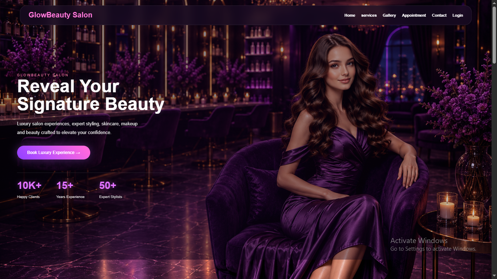
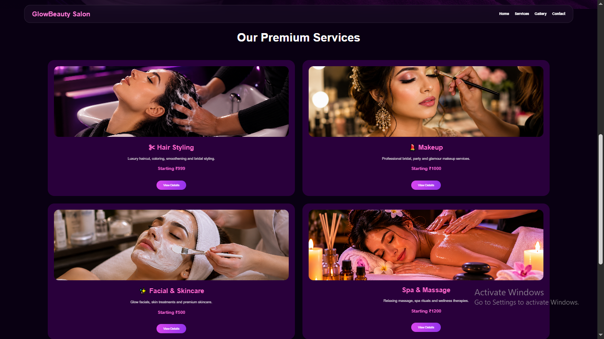
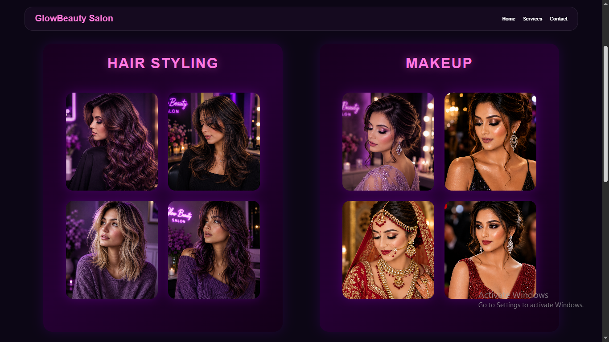
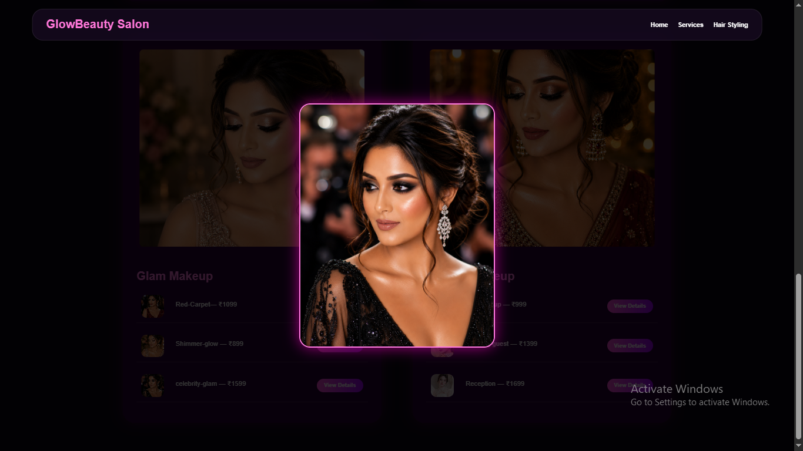
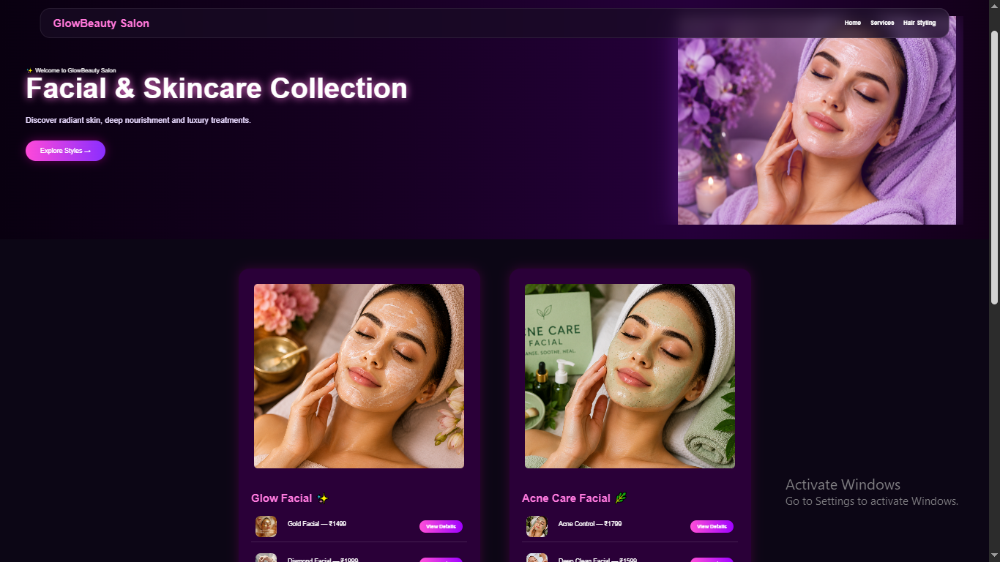
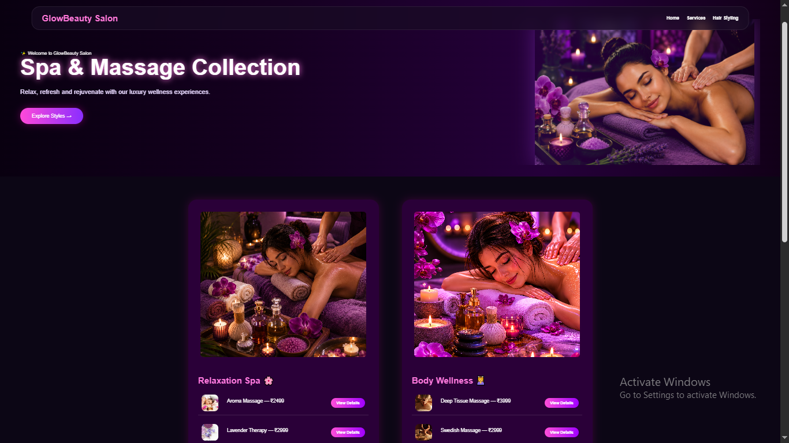
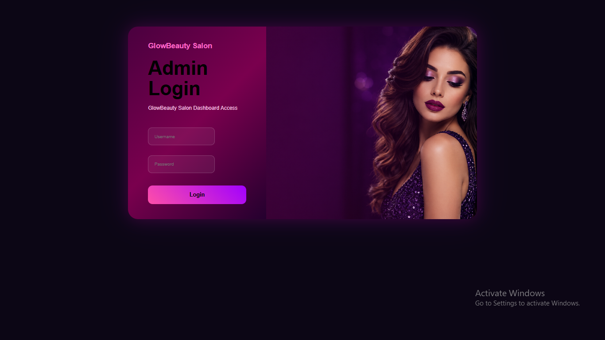
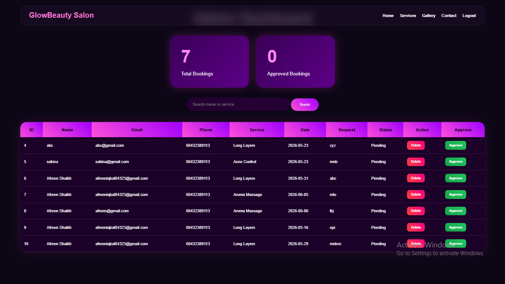

# GlowBeauty Salon Website 💜

Professional luxury salon management website developed for **Future Interns – Task 3**.

GlowBeauty Salon is a full-stack beauty salon web application with online appointment booking and admin management.

---

## ✨ Features

✔ Luxury Purple UI Design
✔ Home Page
✔ Services Page
✔ Gallery Page
✔ Hair Styling Collection
✔ Makeup Collection
✔ Facial & Skincare Collection
✔ Spa & Massage Collection
✔ Contact Page + Google Map
✔ Appointment Booking System
✔ Booking Success Page
✔ Admin Login
✔ Admin Dashboard
✔ Search Functionality
✔ Approve / Delete Appointments
✔ Session Authentication

---

## 🛠 Technologies Used

* HTML
* CSS
* JSP
* Java
* MySQL
* JDBC
* Apache Tomcat

---

## 📸 Project Screenshots

### 🏠 Home Page

### 💎 Services Page

### 🖼 Gallery Page

### 💇 Hair Styling Collection

### 💄 Makeup Collection

### ✨ Facial Collection

### 🌸 Spa Collection

### 📞 Contact Page

### 🔐 Admin Login

### 📊 Admin Dashboard

---

## 💼 Business Benefits

This website helps salons:

* Accept online appointments
* Manage customer bookings
* Improve digital presence
* Simplify appointment management
* Provide a premium salon experience

---

## 👩‍💻 Developed By

**Afreen Shaikh**

Future Interns — Full Stack Web Development Internship
